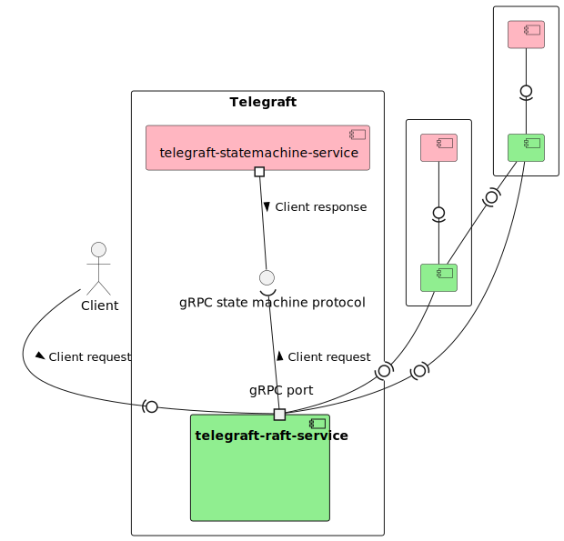

# Telegraft

Telegraft is a university project whose goal is study the [Raft consensus algorithm](https://raft.github.io/):
it is a simple distributed and replicated chat application which supports the Raft protocol.
Telegraft uses Scala and relies heavily on Akka's technologies.

## Architecture

Since it is a distributed application there are many Telegraft nodes, each one is composed of 2 services:
 
 - `telegraft-raft-service` which is the Raft implementation
 - `telegraft-statemachine-service` which is where the actual business logic happens, the state machine receives read 
    and write requests from telegraft-raft-service and queries a database in order to provide an answer.

`telegraft-benchmark-service` is a project based on [Gatling](https://gatling.io/), and its purpose is to 
provide a meaningful benchmark and stress test for Telegraft.
Follows a diagram which shows the interactions between the components at runtime:

## How to improve this project

### Session and authentication

These are arguably the most important missing features. Both **were not even investigated** for 
lack of time.

### Generation of IDs

IDs in the database are auto-incremented integers, this solution is "good enough"
in a small POC, it works because the database itself is only replicated, not sharded: thus all replicas receive the same
write queries. The reason of using integer auto-generated primary keys is that state should be consistent between all replicas:
using any other method would have required setting up a custom way of generating and delivering to replicas unique primary keys.

Of course the current solution is not good in a real-world scenario, where usually the database is sharded and there are many
concurrent writes, many clusters each of them using some kind of consensus protocol. A solution was provided
by Twitter with [Snowflake](https://blog.twitter.com/engineering/en_us/a/2010/announcing-snowflake), the project
is now archived but there are many updated forks.

### Using streams

Both the `telegraft-raft-service` and the `telegraft-statemachine-service` modules could benefit from using
[streaming RPCs](https://grpc.io/docs/what-is-grpc/core-concepts/#bidirectional-streaming-rpc).
A streaming oriented gRPC service supports back-pressure. This could be useful both for communications between clients
and the raft cluster but also between any raft server and its respective state machine.

## More documentation

Further information on the single projects is contained in their READMEs:

 - [telegraft-raft-service](telegraft-raft-service/README.md)
 - [telegraft-statemachine-service](telegraft-statemachine-service/README.md)
 - [telegraft-benchmark-service](telegraft-benchmark-service/README.md).
