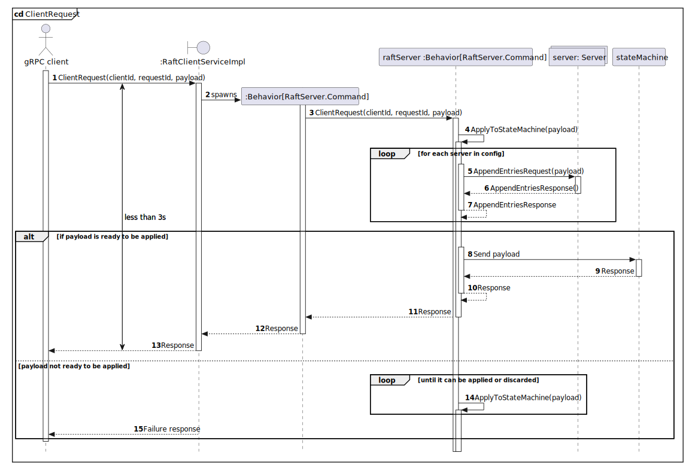

---
title: 'A Raft implementation using the actor model: Telegraft, a distributed chat application'
abstract: |
  This report contains the experience of developing a small POC, it is an implementation of
  the Raft protocol, using the actor model.
  The primary goal of the experience was to learn the Raft protocol and to understand 
  the challenges of building a distributed system. I also try to show the feasibility of
  implementing the protocol using the actor model within Akka's typed actors.
author:
- Alessandro Flori

institute: 
- University of Padua
- Department of Mathematics, Tullio Levi Civita
...

# Introduction

The goal of this report is to show a POC with a Raft consensus algorithm implementation, measure the performance of 
such implementation and draw some conclusions about the results and experience.
The project provides some gRPCs which simulates what I thought the APIs of a chat app could be,
the whole project was ironically named Telegraft.
Telegraft is a persistent, replicated and distributed application:

- persistent because Telegraft persist in stable storage its events
- distributed in the sense that there are multiple instances of Telegraft operating at the same time
- replicated because each instance of Telegraft always operates on the same set of persisted data.

Following an initial investigation I found out that when dealing with a persistent and distributed dataset, 
in an environment where high scalability is needed the following 3 ideas seem the ones applied in a real-world setting:

- either the database itself can be split, meaning the tables can be distributed across multiple servers 
  or the tables themselves can be split
- the database is replicated, which is the solution explored in this report
- a hybrid solution in which the database itself is somehow split between the servers and replicated as well.

[CockroachDB](https://www.cockroachlabs.com/) and [Apache Cassandra](https://cassandra.apache.org/_/index.html) are 2 
popular databases that apply the techniques described above.

In order to support multiple instances of the same application and to have always and transparently the same state 
in every replica there must be some way to keep data synchronized correctly. 
This problem is called consensus: each replica should agree on the data and should have the latest version of such 
data at any moment. 
The first algorithm that (arguably) solved this problem is Paxos, which has the following problems:

- it is a protocol, as such it is very loosely specified, and it must not be tied to any programming language nor 
implementations, the consequence is that there are many projects bringing a Paxos-like algorithm, but each one of them 
interprets Paxos in a somewhat personal way
- Paxos is a very complicated protocol, difficult to implement and to understand.

Paxos is followed more than 20 years later by Raft, which aims at solving the problems listed above:

- there shouldn't be room for interpretation, in fact where needed [Raft paper](https://raft.github.io/raft.pdf) is 
- very meticulous, of course implementors add their own flavour, but the core of the protocol is clearly defined
- it tries to be easy to learn and to understand (and the paper tries to show it).

Telegraft in order to be replicated needs consensus, in fact it implements Raft.

[//]: # (purpose and aspects to be investigated)

The purpose of this POC and what I am interested in is if the Raft protocol can be implemented using the 
[actor model](https://en.wikipedia.org/wiki/Actor_model): 

- if it is easier to implement it through actors than the typical object-oriented paradigm
- the performance of such implementation (which of course is not tied only to the actor model but also to the runtime chosen).

At first glance the actor model is a perfect fit for Raft: a node (or server) in a cluster is an actor,
such actor has the usual 3 states Follower, Leader, Candidate, it reacts differently, meaning replies and sends different
messages depending on the current state. The following paragraphs will confirm (or disprove) this observation.

I also want to test my implementation against a workload in order to show its performances.
For this purpose the POC contains a benchmark, such benchmark shows the latency and how it changes as the workload
grows.

# Work product

Telegraft comprises 3 separate projects:

 - `telegraft-benchmark-service`, which provides a benchmark to the application
 - `telegraft-statemachine-service`, which provides some gRPCs to interact with a database
 - `telegraft-raft-service`, which is the raft implementation.

All these 3 services are implemented using Scala 2.13 and communicate between each other using a gRPC protocol.
A REST API was considered as well, but gRPC is well suited for a microservices oriented architecture and, it is
surprisingly simple to implement.

## The state machine: `telegraft-statemachine-service`

As the title and the name of the service suggests, the service is the state machine mentioned in the Raft paper.
It provides a state, which is the database, as well as something to test the Raft implementation on.

The service uses the following technologies:

 - gRPC and `Akka-gRPC` that provides the necessary APIs to work with gRPC in Scala
 - Slick, which is a Scala library for database access and manipulation
 - it is plugged in to a Postgresql instance.

It is a very simple service overall, it provides some gRPCs which I think could be used in a chat application,
receives requests and executes them against a database. Such requests are:

 - `CreateUser(username)`, creates a user with the given username
 - `CreateChat(userId, chatName)`, creates a chat with a member and the given chat name
 - `JoinChat(userId, chatId)`, a user joins a chat
 - `SendMessage(userId, chatId, content, sentTime)`, a user sends a message to the given chat with the given content,
and a timestamp which marks the time the message was sent
 - `GetMessages(userId, messagesAfter)`, gets all messages a user received in the chat they are a member of, after 
`messagesAfter` which is a timestamp
 - `getChatUsers(chatId)` gets all users of a chat.

The database model is purposely very simple: a user, which was called `customer` can create and become member of one or 
more `chat`s, and can write one or more `message`s. 
A `chat` must have at least one member and contains zero or more `message`s. Each message is written by one
`customer` and it owned by one `chat`.

As I already said, the model is very simple: there are no validity checks, both in the model nor in the application 
itself, for example a `customer` can write in a `chat` he is not a member of.

Another simplification one can notice at first glance is that ids are autogenerated integers, which is not at all what 
is usually done in a real application. Take the table messages: in big chat applications millions, possibly billions 
of messages are sent per day, integer keys would finish very fast. A UUID could have been a smarter idea, but then I 
would need the primary key shipped directly with the command, otherwise in a distributed setting where there are many
`telegraft-statemachine-service`s the same record would have different primary keys across replicas. The latter means 
that there should be some middleware before `telegraft-statemachine-service` capturing a client's command, giving it a 
key before handling it to the state machine. Such middleware must generate consistent keys across all replicas. 
I decided not to deal with this complication.

## The Raft implementation: `telegraft-raft-service`

### Brief Akka typed actors

This subsection contains a brief introduction to Akka typed actors, it should be enough to follow the rest of the 
report.

The actor model
: The actor model is a way of designing concurrent processes and systems where an actor is the most basic entity.
An actor sends and receives messages and creates child actors and holds a local state. 
Actors interact between each other only through messages, follows that an actor can modify another actor's state only
by sending it a message.

Akka typed actors
: Akka typed actors are comprised of a behavior, a state and a mailbox. A behavior decides how an actor responds to 
a message (or command, as per Akka naming conventions). The mailbox is a queue, each new command sent to an actor is 
put here, waiting for its turn to be processed, the queue is FIFO. Actors in Akka are typed, meaning that they can only
receive a certain type of commands. An actor in Akka is a reference to an object that contains a state and 1 or more 
behaviors, that is because an actor's behavior can change as a consequence of receiving a certain command. Further
information here: <https://doc.akka.io/docs/akka/current/general/actors.html>

Akka event sourced behavior or persistent actor
: An event sourced behavior (or persistent actor) is a special type of actor: it is a persistent actor, meaning it can 
persist data in storage, and it generates events when it receives commands. Commands can no longer change the current 
state, but commands produce events, and events change the state. Events are what is actually persisted, and
replaying the events the order they arrived to the latest event will yield an actor's current state. Producing events
is useful for the following reasons: it allows to decouple reactions to commands from state changes, and events could
be fed into (or captured by) an external resource, for example to create a log or build a database.
Further information can be found at the following link: 
<https://doc.akka.io/docs/akka/current/typed/persistence.html#introduction>.

### Design

A raft server in the cluster is a grpc server, which handles its requests and responses
via a persistent actor.

`telegraft-raft-service` is built around the component RaftServer: it is the Raft persistent actor, and it is
represented as a singleton object in the class diagram, this singleton object has an `apply` method which will create
an instance of a proper (persistent) actor. Both the commands and the events the actor receives and produces are defined
inside the object RaftServer itself, this is an Akka convention. The state of the actor should be defined in the same
RaftServer object, but, since the line count was getting to large an object RaftState was created. RaftState contains
the states a Raft actor could be in as well as how to react to events.

A RaftServer holds an instance of a Configuration, which holds a collection of `Server`s, which are the other 
Raft servers in the cluster. The Configuration reads a configuration file and then builds all the servers. A `Server`
holds information about how to reach a Raft server: sends and receives gRPC requests from a node.

### Correctness of Raft implementation

I created some unit tests, which test the behavior of 1 Raft persistent actor against other mocked components.
These unit tests are not exhaustive and, while they are not static tests, meaning, the Raft actor is a real, working
instance they do not show the correctness of the implementation or prove any properties. In fact many errors and bugs
were solved while studying the behavior at runtime. A proper and fuller suite of integration and system tests, could 
definitely be the subject of further development.

### Raft implementation choices

#### The message queue

[//]: # (Interaction pattern)

#### Log

There is a Log class, which wraps a collection of tuples comprised of:

- the log item (payload or request)
- the term the log item was added
- the client id and request id in order to retrieve the answer in the eventuality that the client did not receive the
  response
- the (optional) response the raft server received from applying the payload to the state machine.

> Note that the grpc protocol itself does not carry the response of the raft server, that is because (of course) each
> raft server must apply the request to its own state machine.

#### Response timeouts

In a network of nodes (raft servers) there can be many delays, such delays must be accounted and the Raft algorithm must
not fail if a timeout happens while waiting for a response. Waiting indefinitely for a response is not reasonable in
real world conditions. For this reason:

- when doing any network request a timeout is in place (a very generous 3 seconds timeout)
- if such timeout elapses instead of throwing an exception a "smart" answer is given, in such a way that the raft
  algorithm can continue, the answer is harmless meaning that there will be no problems when the real answer is
  received.

#### Interaction with clients

Clients can query each one of the replicas, and they will get a response:

- the raft paper suggests the client should send requests only to the leader, if a client
  sends a request to a follower the follower should answer with the leader's address
- the implementation supports clients sending requests to a follower, the follower will then
  forward the request to the leader and wait for the leader's answer, finally it will hand out
  such answer to the client.
- if the current state is `candidate` then the request is sent in the bottom of the actor's message queue,
  hoping that the state will be different when the request is reached again.

> **NOTE** that this implementation choice could lead to frequent timeout errors on the client side,
> for this reason the raft cluster could keep track of the client identity and assign an id to each request
> in order to not compute a request twice. This is suggested in §4 of the following
> [document](https://web.stanford.edu/~ouster/cgi-bin/papers/OngaroPhD.pdf)

## Deployment

## Evaluation experiments

### The benchmark: `telegraft-benchmark-service`

This project is a small Scala script built with a test and benchmarking framework called [Gatling](https://gatling.io/).
Gatling is originally a load testing tool for http protocols, it provides many interesting features, such as:

 - light simulation of multiple users (in fact it uses Akka and actors under the hood)
 - control over users, for example I can tell Gatling to slowly rump up the number of concurrent user
 - automatic report generation.

It acts both as a benchmark for a cluster of Raft nodes.
Inside the project's folder there is a docker-compose configuration, which loads 3 Raft servers, coupled with the
respective state machines. The state machines databases are preloaded with data.

The benchmark comprises (roughly) the following steps:

1. in parallel, an increasing number of users, until 100, during the span of 20 seconds, stay active until all the
   responses are received or 100 failed requests are received
2. send a gRPC `ClientQuery` request to one of the 3 Raft servers, such gRPC contains a request `GetMessages` for a
   random user, for the state machine
3. send a gRPC `ClientRequest` request to the same address as before, with a `SendMessage` payload, which sends a
   message to a random chat of the previous user
4. if any of these gRPCs responses have `status = false`, then the response is counted as a failure.

machine specs

 - test with message queue
 - test without message queue

### Results of the evaluation experiments

Bottleneck/error in the implementation
Message queue

# Self-assessment

## Candidate’s own critique of own exam work (achievements, failures)

Couldn't show Raft correctness. Many important features both of Raft and both
of a normal production ready application are missing due to lack of time.

## Discussion of the candidate’s learning outcomes

This journey involved lots technologies, gRPC, databases, Akka, and a benchmark tool which will be valuable tools under the belt. Designing a distributed application is hard. Raft algorithm. Implementing protocols. Actor interaction patterns. Futures. Docker. 