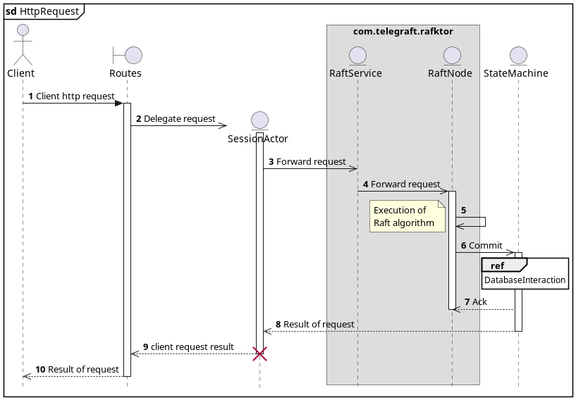
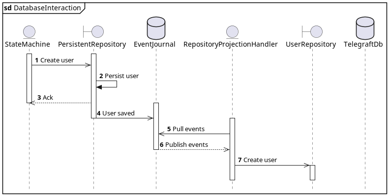
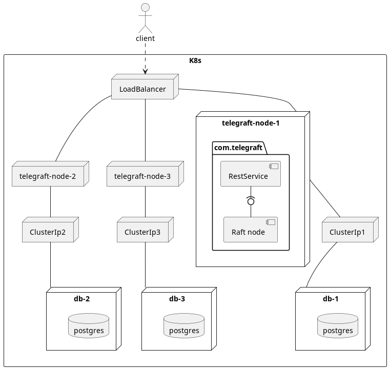
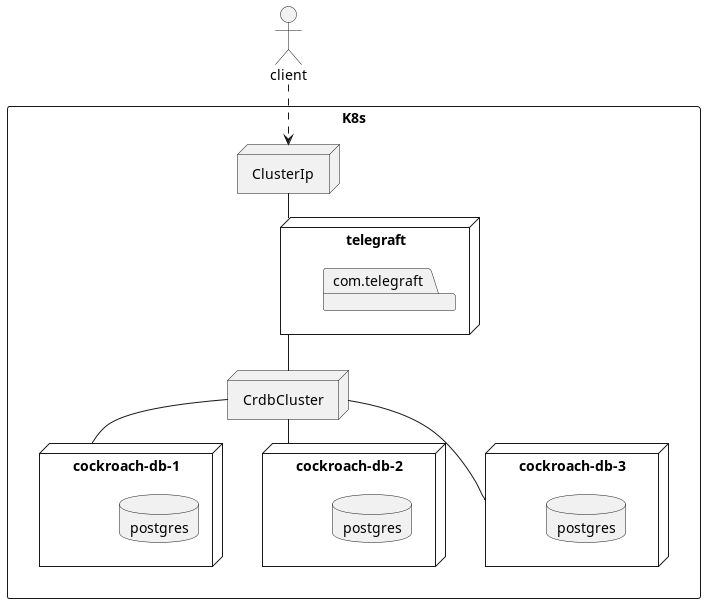

# Goals

 - Understand Raft consensus algorithm
 - implement Raft consensus through actor model
 - build meaningful benchmarks 
 - understand how Raft is used in real word scenario.

# Telegraft application

A simple chat application with a replicated storage with no support for authentication and sessions.

 - Use of actor model and technologies from the Akka framework
 - Postgres database
 - Kubernetes deployment.

-----------------

## Generic client interaction

---------------------------------

## Database interaction

# System architecture

Follows a representation of the deployment architecture.

-----------------------------------

## With Raft implementation 

{width=70%}

----------------------------------------

## CockroachDB

 - Distributed replicated database
 - Postgres wire compatibility
 - uses Raft protocol.

--------------

{width=70%}

# References {.allowframebreaks}
