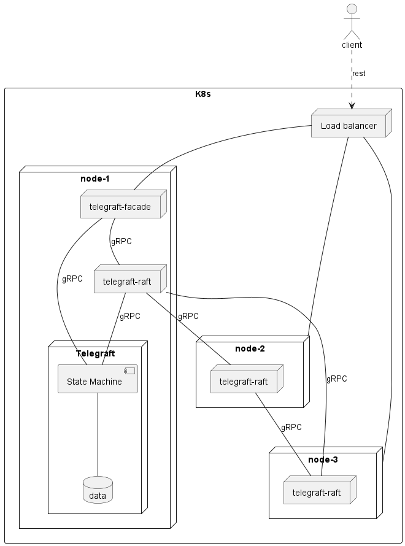

# Progress

 - Greater understanding of the Raft protocol: {width=50%}
 - project goal refined:
   - focus on Raft implementation
   - building relevant benchmarks exploiting latency and load capabilities
 - use of gRPC for communication between services
 - identified 2 benchmarking tools: [ghz](https://ghz.sh/) and [Gatling](https://gatling.io/).

# Questions

 - Read only queries in Raft, [@ongaro2014consensus]: great load on leader
 - should the consensus service/module completely shield the replicated state machine
 - should the consensus module be completely agnostic about the state machine underneath.
 