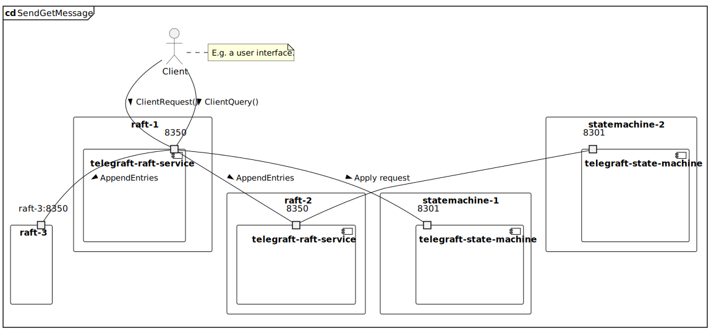

# telegraft-benchmark-service

This project is a benchmark and a stress test for a cluster of `telegraft-raft-service`s.
It sends network packets and waits for a successful response.
Network packets are sent towards `localhost:8350`, `localhost:8351` and `localhost:8352`.
A docker-compose configuration starts all the necessary services and populates the database. 
2 docker compose configurations are provided: follows an example.

## The benchmark

Before running the benchmark it is needed to:

 - install local docker images of `telegraft-raft-service` and `telegraft-statemachine-service`
 - load the databases with some data, the database is automatically preloaded with data from `/src/main/resources/db`.

The benchmark is composed of the following steps.
First, in parallel, an increasing number of users make a sequence requests until all the 
responses are received, such requests are, in order:

1. send a gRPC `ClientQuery` request to one of the 3 addresses, such gRPC contains a request `GetMessages` for a 
random user
2. send a gRPC `ClientRequest` to the same address as before, with a `SendMessage` payload, which sends a 
message to a random chat of the previous user
3. if any of these gRPCs responses have `status = false`, then the response is counted as a failure
4. if an actor receives a failed response, then it shuts down immediately, even if its routine did not finish.

I designed 2 different types of benchmarks:

 - a stress test, each client (100 clients) makes in parallel the requests from above, I designed this test, in
order to run as fast as possible, for a set amount of time
 - a throttled test, a test with parallel requests capped.

The goal is to study the response times of 2 docker configuration, with 3 and 5 Telegraft servers.

## Instructions

1. run one of the 2 docker compose configurations
2. compile and run the project via `sbt gatling-it:test`
3. when finished the folder `/target/gatling-it` will contain the test results.
