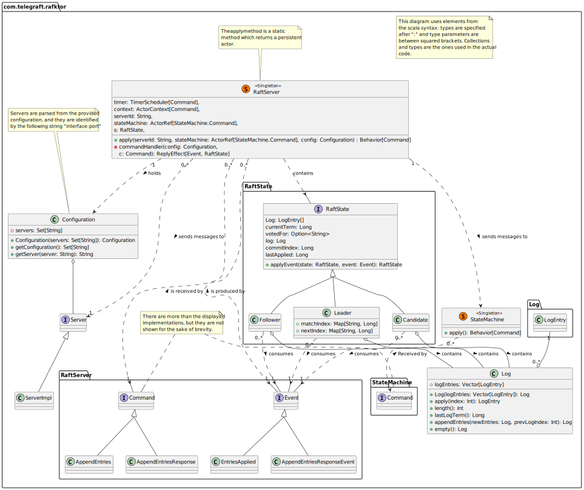

# telegraft-raft-service (Rafktor)

## Build and start locally

Requires a JDK distribution, preferably version 17, and a Docker installation.
Building and starting the project requires the following command:

1. `sbt docker:publishLocal` 
2. `docker-compose up`: the project is shipped with a docker-compose configuration, which launches 9 docker containers, 3 triads of
   a Postgresql database, a state machine (`telegraft-statemachine-service`) and a Raft server (this project).

Then you can try and create a user, for example using `grpcurl` or a grpc client such as [BloomRPC](https://github.com/bloomrpc/bloomrpc).
The cluster can be reached from local ports 8350, 8351, 8352. Follows an example of grpc command which creates a new user:

```
grpcurl -d '{
  "clientId": "ffce7200-7528-4649-92e7-ebea3b76ad69",
  "requestId": "13cbc801-1106-4b31-8997-71c1856",
  "payload": {
    "createUser": {
      "username": "Hello"
    }
  }
}' -plaintext 127.0.0.1:8350 com.telegraft.rafktor.TelegraftRaftClientService.ClientRequest`
```

## Implementation choices

A raft server in the cluster is a grpc server, which handles its requests and responses
via a persistent actor, more precisely an [event sourced actor](https://doc.akka.io/docs/akka/current/typed/persistence.html#introduction):
such actor is able to persist its state in stable storage.
An event sourced actor is slightly different (and more complex) than a typical actor,
since it doesn't only receive commands but produces events as well:

- the actor receives a command, runs some validation checks
- each command may produce an event, events (are the only way to) change the actor's state
- events are what is actually persisted
- the actor should then be able to recover its state by simply replaying all the events produced.

In the Akka framework a persistent actor is an object which receives as parameters 2 functions:

- a `commandHandler` which is a function from a command and a state, to an event
- an `eventHandler` which takes as input an event and a state, and produces a new state.

Producing events is particularly useful for the following reasons:

- it allows to decouple reactions to commands from state changes
- events could be observed from an external source (e.g. to keep a log, run analysis, build a dataset for queries).

In the following few paragraphs I refer to the actor which serves the raft node grpc server as
raft server or actor or simply server. Follows a short deepening about notable characteristics of the implementation.

## Project structure

```
src/main
├───protobuf
│     Rafktor.proto
│     RafktorClient.proto
│     TelegraftStateMachine.proto
│
├───resources
│     application.conf
│     logback.xml
│     raft.conf
│
└───scala
    └───com
        └───telegraft
            └───rafktor
                  CborSerializable.scala
                  Configuration.scala
                  Log.scala
                  Main.scala
                  PriorityMailbox.scala
                  RaftClientServiceImpl.scala
                  RaftServer.scala
                  RaftServiceImpl.scala
                  RaftState.scala
                  Server.scala
                  ServerImpl.scala
                  StateMachine.scala
                  TelegraftRaftServer.scala
```



## The `RaftServer` actor


### Timers

Each raft server implements a timer: such timer works both as the election timeout and
the idle time after which the leader sends heartbeats to every other raft server in the cluster.
The timer is a random wait between 150 and 300 ms, as per Raft paper suggestion.
Each time the timer is elapsed the actor sends to itself a command:

 - if the server is currently a follower or a candidate, the command starts an election,
 - if the server is a leader, the command triggers a heartbeat
 - the timer is then restarted to a random wait.

The timer is a single timer and should be handled with care: it should be reset properly or else the algorithm itself
won't work.

Later in the development the wait of heartbeats was differentiated from the wait of election timeouts, because otherwise
election timeouts could happen before the leader had even the chance to send the heartbeats. The current timeout
between heartbeats is set to 100 milliseconds.

### Clients interaction

Clients can query each one of the replicas, and they will get a response:

 - the raft paper suggests the client should send requests only to the leader, if a client
   sends a request to a follower the follower should answer with the leader's address
 - the implementation supports clients sending requests to a follower, the follower will then
   forward the request to the leader and wait for the leader's answer, finally it will hand out
   such answer to the client.
 - if the current state is `candidate` then the request is sent in the bottom of the actor's message queue, 
   hoping that the state will be different when the request is reached again.

> **NOTE** that this implementation choice could lead to frequent timeout errors on the client side,
> for this reason the raft cluster could keep track of the client identity and assign an id to each request
> in order to not compute a request twice. This is suggested in §4 of the following 
> [document](https://web.stanford.edu/~ouster/cgi-bin/papers/OngaroPhD.pdf)

### Client responses

Client responses handling deserve an explanation as well.
What currently happens is:

1. a Raft server receives a request from a client, if it is a follower such request is forwarded to the leader
2. the leader immediately pipes to himself a message to apply the client request to its state machine
3. the request is repeatedly pushed down into the message queue until the Raft algorithm commits it
4. after the request is committed it can be applied, which means to delegate to a temporary actor the retrieval of the
   response from the state machine, the response is then sent back to the actor, and when such response is reached in
   the message queue it is finally sent to the client.

This is a long and prone-to-programmer-error process, it is slow and when there are lots of client requests an actor's
queue can be filled with requests waiting to be applied, which will be applied very slowly since when the queue grows 
larger the Raft algorithm itself is affected. The `telegraft-benchmark-service` shows it: more client requests
means increasing timeout errors.

A practical solution would be to add to the state itself some kind of collection keeping the client responses waiting 
to be applied: the actor could then check whether if any request can be applied before executing any command. When 
requests can be applied step 4 of the process above can be applied. This is left for future developments.

### Timeouts

In a network of nodes (raft servers) there can be many delays, such delays must be accounted and the Raft algorithm must
not fail if a timeout happens while waiting for a response. Waiting indefinitely for a response is not reasonable in
real world conditions. For this reason:

 - when doing any network request a timeout is in place (a very generous 3 seconds timeout)
 - if such timeout elapses instead of throwing an exception a "smart" answer is given, in such a way that the raft 
   algorithm can continue, the answer is harmless meaning that there will be no problems when the real answer is
   received.

### Log

There is a Log class, which wraps a collection of tuples of:

 - the log item (payload or request)
 - the term the log item was added
 - the client id and request id in order to retrieve the answer in the eventuality that the client did not receive the
   response
 - the (optional) response the raft server received from applying the payload to the state machine.

> Note that the grpc protocol itself does not carry the response of the raft server, that is because (of course) each
> raft server must apply the request to its own state machine.

### The message queue

Any actor has its own message queue, each rpc request and response is received and put into the 
message queue waiting to be processed. The default message queue in Akka is unbound and FIFO, but it can be changed,
for example the concept of priority.

[//]: # (Further information on how Akka actors message queue can be found at the following link)

This could lead to interesting observations, such as: how does giving priority to any commands other than the Raft RPCs
affect response times? For example how about giving the highest priority to shipping responses to clients? It is left
for future developments.

## Further development and investigation

 - Clients identity, session and request ids
 - reimplement client response handling
 - investigate on how introducing priorities in the Raft actor message queue can affect latency
 - there is no indication against persisting more than the vote, the term and the log and the state itself.

This implementation is only the basic Raft, only `AppendEntries RPC`s and `RequestVote RPC`s, in future developments
it could be considered to add the InstallSnapshot RPC and cluster membership changes.
