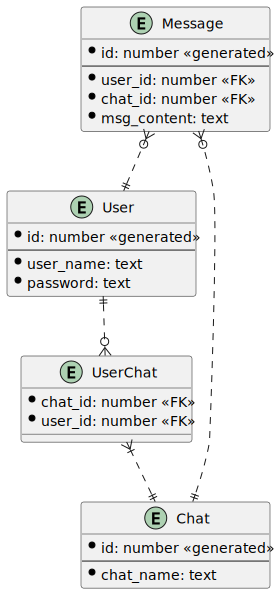

# telegraft-statemachine-service

This is a simple service based on [Slick](https://scala-slick.org/) and 
[Akka-gRPC](https://doc.akka.io/docs/akka-grpc/current/index.html). It acts as a frontend
for a Postgresql database.
It can receive 6 gRPCs, which simulate what a chat service could use:

- `CreateUser`
- `SendMessage`
- `CreateChat`
- `JoinChat`
- `GetMessages` 
- `GetChatUsers`.

The data model and the gRPCs are intentionally kept as simple as possible, as
the goal of this small service is only to provide a use case for the raft cluster.

## Data model



## How to run

Follows instructions to build and run the project in a docker container.
The project must be compiled first, using `sbt docker:publishLocal` this command
builds the project and creates an alpline jre container for the local docker
environment.

It is provided a docker-compose configuration, which starts this service and
a postgres database, the 2 services can be found locally at the ports `8301` and `5432`.
After starting the configuration one can try and launch a gRPC command, for example using
`grpcurl` or a client such as BloomRPC. For example:

```
grpcurl -d '{"username":"Alessandro"}' -plaintext 127.0.0.1:8301 com.telegraft.statemachine.CreateUser
```
